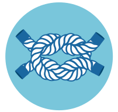

<div align="center">

</div>

Gordian
========

[](https://github.com/argoproj-labs/gordian/releases/)
[](https://pypi.python.org/pypi/gordian/)
[](https://codecov.io/gh/argoproj-labs/gordian/)
[](https://github.com/argoproj-labs/gordian/actions?query=workflow%3A%22Python+package%22)
[](https://hub.docker.com/repository/docker/argoprojlabs/gordian)

Gordian applies transformations to files in github repositories and create PRs for the owners of the repositories review and merge them.

This project grew from a need to keep k8s onboarded services consistent and roll out changes at scale, so the main use case for this tool
is to be able to update the kustomize configuration for all our services.

This module installs one executable:
    - `gordian` can search and replace strings from files.

It is designed with extensibility in mind, here is an example how to extend it to configure the HPA min/max values of our deployments to not scale.

```python
import sys
from gordian.gordian import get_basic_parser, apply_transformations
from gordian.transformations import Transformation

class PreScale(Transformation):

    def __init__(self, args, repo):
        super().__init__(args, repo)
        self.environments = args.environments

    def run(self):
        for env in self.environments:
            file = self.repo.get_objects(f'overlays/{self.environments}/envconfig-values.yaml')

            for obj in file:
                if obj['kind'] != 'HorizontalPodAutoscaler':
                    continue

                if obj['spec']['minReplicas'] != obj['spec']['maxReplicas']:
                    obj['spec']['maxReplicas'] = obj['spec']['minReplicas']

            file.save(f'Setting maxRelicas = minReplicas = {obj['spec']['minReplicas']}', self.dry_run)


if __name__ == '__main__':
    parser = get_basic_parser()
    parser.add_argument(
        '-e', '--environments',
        required=False,
        dest='environments',
        default='prd-.*',
        help='Environments to update.'
    )
    args = parser.parse_args(sys.argv[1:])
    apply_transformations(args, [PreScale])
```


Installation
============
```
pip install gordian
```

Docker image
============
```
docker run --rm -it argoprojlabs/gordian:latest -h
usage: gordian [-h] [-c CONFIG_FILE] --pr PR_MESSAGE [-v] [-d] [-M | -m | -p]
                -s SEARCH -r REPLACE

optional arguments:
  -h, --help            show this help message and exit
  -c CONFIG_FILE, --config CONFIG_FILE
                        Config file path. (default: config.yaml)
  --pr PR_MESSAGE       Pull request name. (default: None)
  -v, --verbose
  -d, --dry-run         Enable dry run mode (default: False)
  -M, --major           Bump the major version. (default: False)
  -m, --minor           Bump the minor version. (default: False)
  -p, --patch           Bump the patch version. (default: False)
  -s SEARCH, --search SEARCH
                        The string to search for in config files. (default:
                        None)
  -r REPLACE, --replace REPLACE
                        The string that will replace instances of the searched
                        string. (default: None)
```

Development
===========
The simplest way to hit the ground running if you want to contribute with code is using docker, launch a python container:
```
localhost$ docker run --rm -it  -v $(pwd):$(pwd) -w $(pwd) python:3.7-stretch bash
```

Install the project and test dependencies in developer mode:
```
container# pip install -e .[test]
```

Run the tests:
```
container# pytest
=========================================== test session starts ============================================
platform linux -- Python 3.7.1, pytest-4.5.0, py-1.8.0, pluggy-0.11.0
rootdir: /Users/user/git/argoproj-labs
plugins: requests-mock-1.6.0, cov-2.7.1
collected 33 items

....
================================== 33 passed, 2 warnings in 1.73 seconds ===================================
```

Happy hacking!!
